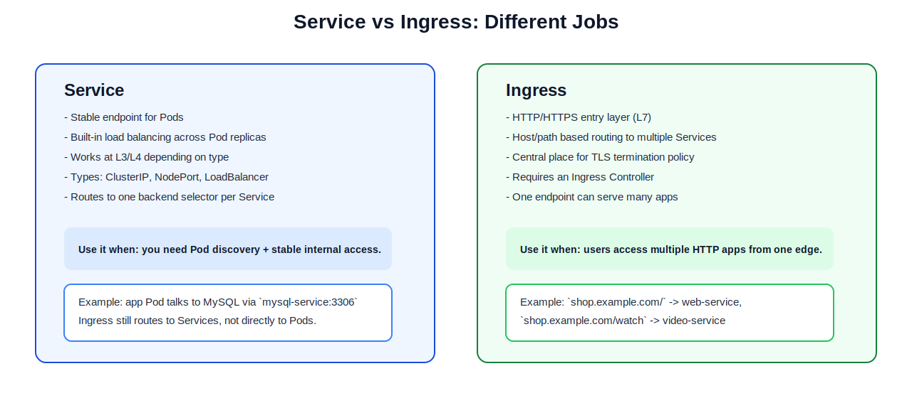
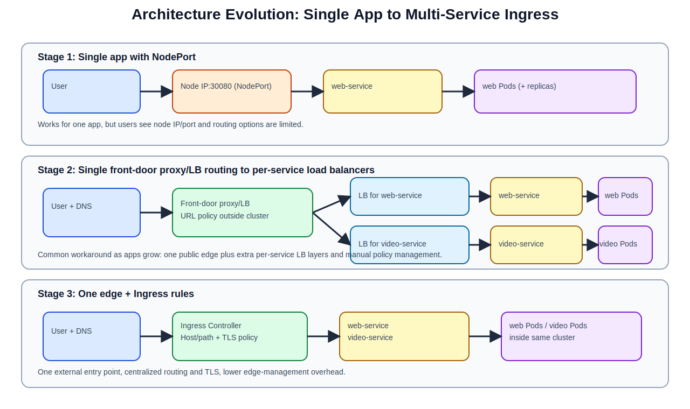
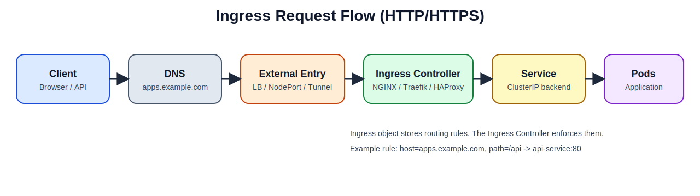
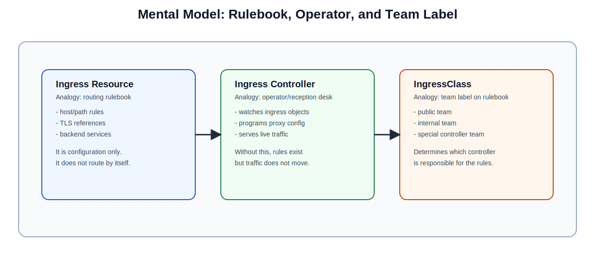
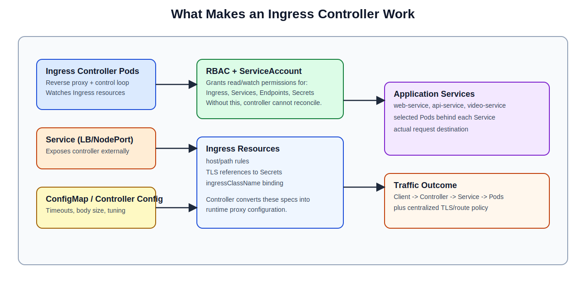
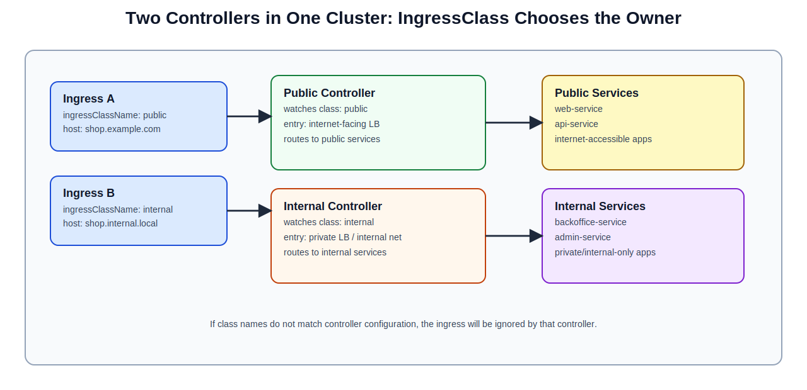
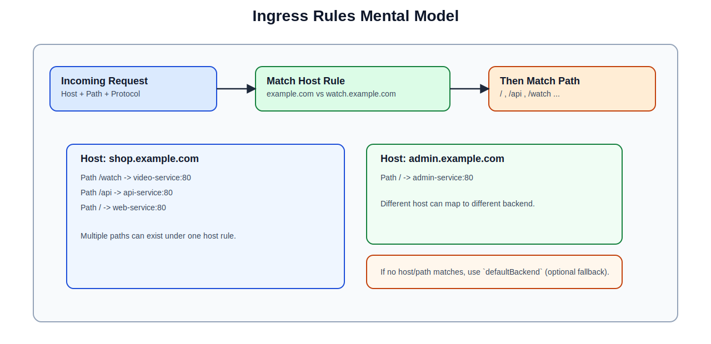
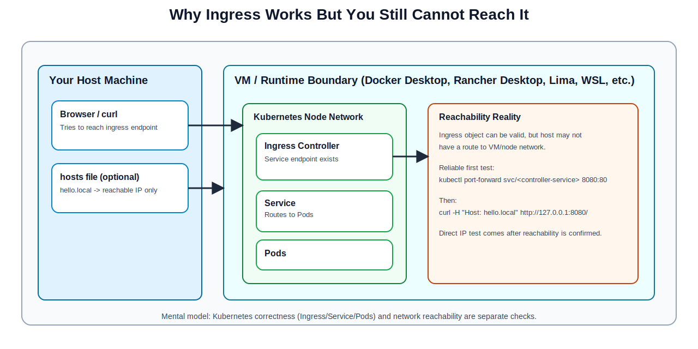
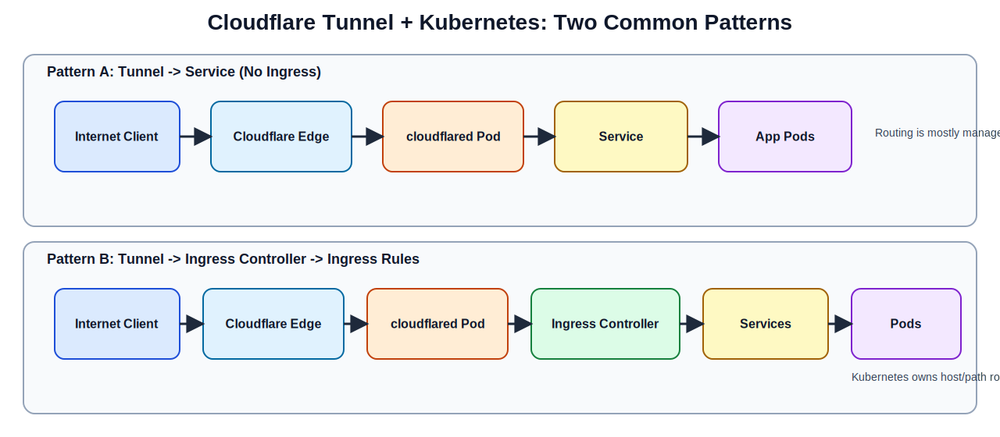
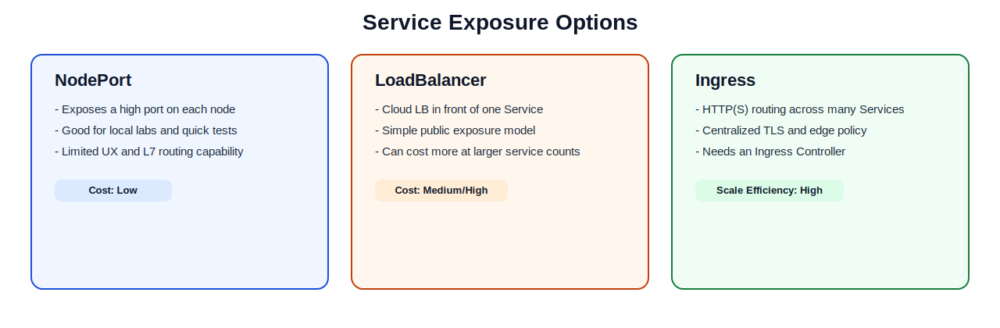

# Kubernetes Ingress: Zero-to-Expert Guide

This guide is built to eliminate the most common confusion in Kubernetes networking: what `Ingress`, `Ingress Controller`, and `IngressClass` actually are, and how they work together in real environments.

## What You Will Learn

1. The exact job of `Service` vs `Ingress`.
2. The difference between `Ingress` (config), `Ingress Controller` (runtime), and `IngressClass` (binding).
3. How to install an Ingress controller correctly.
4. How to run two controllers in one cluster and choose one with `ingressClassName`.
5. How to test and troubleshoot in Docker Desktop, Rancher Desktop, k3s, and cloud Kubernetes.

## Learning Path

1. Beginner: Build one working ingress flow.
2. Intermediate: Add path/host/TLS and default backend behavior.
3. Advanced: Multi-controller architecture, class isolation, and production operations.

## 1) Starting Point: Service Before Ingress

A realistic first architecture:

1. Deploy your web app with a Deployment.
2. Deploy MySQL and expose it with a `ClusterIP` Service.
3. Expose the web app with `NodePort` or `LoadBalancer`.

What Services already solve well (real examples):

- Stable endpoint despite Pod churn:
  checkout app keeps using `mysql-service:3306` even when DB Pods restart.
- Replica balancing:
  scaling `web` from 2 Pods to 10 Pods still keeps one stable endpoint (`web-service`).
- Internal discovery:
  in-cluster apps call `http://web-service` instead of unstable Pod IPs.
- Controlled exposure:
  `ClusterIP` for internal traffic, `NodePort`/`LoadBalancer` for external entry.

What Services do not solve alone at scale:

- Host/path routing across many apps (`shop.example.com/` vs `/watch`).
- One central place for TLS policy.
- Cost and operations when each service gets separate external edge config.

## 2) Service vs Ingress (Quick Decision)



| Need | Use |
|---|---|
| Pod-to-Pod communication | `Service (ClusterIP)` |
| Expose one app quickly | `Service (NodePort/LoadBalancer)` |
| One entry for many HTTP apps | `Ingress + Ingress Controller` |
| Central TLS + URL routing policy | `Ingress + Ingress Controller` |

Critical truth:

- Ingress always routes to Services, not directly to Pods.

## 3) Why Ingress Exists: Architecture Evolution

As one app becomes many apps, teams usually add more edge components. Ingress moves this edge policy into Kubernetes-native objects.



How to read the stages:

1. Stage 1: one app and one NodePort entry.
2. Stage 2: one front-door proxy/LB, then routing to service-specific LBs.
3. Stage 3: one external entry and Kubernetes-managed host/path/TLS policy.

On-prem pattern before Ingress:

- `DNS -> reverse proxy (Nginx/HAProxy) -> NodePort services`.

Cloud nuance:

- `Service type=LoadBalancer` often still uses node-level service plumbing under the hood while provisioning cloud LB endpoints.

## 4) Core Concepts You Must Not Mix Up

- `Ingress` is declarative routing configuration (`kind: Ingress`).
- `Ingress Controller` is the running data-plane/control-plane software.
- `IngressClass` is the selector contract: which controller owns which ingress.



## 5) Deep Analogy: Rulebook, Operator, Team Label

Analogy:

- `Ingress Resource` = rulebook (what routes should exist).
- `Ingress Controller` = operator/reception desk (enforces rules in real traffic).
- `IngressClass` = team label on the rulebook (which operator must execute it).



### Ingress Resource (the rulebook)

What it is:

- Namespaced object with host/path/TLS intent.
- References backend Services.

What it is not:

- Not a running process.
- Not a proxy by itself.

Inspect:

```bash
kubectl get ingress -A
kubectl describe ingress -n <namespace> <ingress-name>
```

### Ingress Controller (the operator)

What it is:

- A Deployment/DaemonSet-based runtime that watches Ingress objects and programs actual routing.

Without it:

- Ingress YAML exists, but no traffic is routed.

Inspect:

```bash
kubectl get ingressclass
kubectl get svc -A | grep -Ei 'ingress|nginx|traefik|haproxy|alb|gateway'
kubectl get pods -A | grep -Ei 'ingress|nginx|traefik|haproxy|alb|gateway'
```

### IngressClass (the team label)

What it is:

- Binding between Ingress objects and a specific controller.

Where it is used:

- `spec.ingressClassName` in Ingress YAML.

Common failure mode:

- Ingress uses class `public`, controller watches `nginx`, so rule is ignored.

Inspect:

```bash
kubectl get ingressclass
kubectl get ingress -A -o wide
```

### Controller runtime pieces (what is actually running)

Think of this as the operations stack behind the operator:

- controller Pods (watch + reconcile ingress rules),
- controller Service (the traffic entrypoint),
- RBAC + ServiceAccount (read access to ingress/service/endpoints/secrets),
- controller configuration data (timeouts, limits, tuning).



## 6) Install One Ingress Controller (Hands-On)

This section uses `ingress-nginx` with Helm.

Prerequisites:

- `helm` installed.
- Cluster admin permissions.

Install:

```bash
helm repo add ingress-nginx https://kubernetes.github.io/ingress-nginx
helm repo update

helm upgrade --install ingress-public ingress-nginx/ingress-nginx \
  --namespace ingress-public \
  --create-namespace \
  --set controller.ingressClass=public \
  --set controller.ingressClassResource.name=public \
  --set controller.ingressClassResource.default=false \
  --set controller.ingressClassResource.controllerValue=k8s.io/public-ingress-nginx \
  --set controller.extraArgs.controller-class=k8s.io/public-ingress-nginx \
  --set controller.electionID=public-ingress-nginx-leader \
  --set controller.service.type=LoadBalancer
```

Verify:

```bash
kubectl get pods -n ingress-public
kubectl get svc -n ingress-public
kubectl get ingressclass
```

Important:

- Chart values can vary by chart version. Verify with:

```bash
helm show values ingress-nginx/ingress-nginx | less
```

## 7) Install a Second Controller in the Same Cluster

Use case:

- `public` controller for internet-facing apps.
- `internal` controller for private apps.

Install second controller (same chart, different class and controller identity):

```bash
helm upgrade --install ingress-internal ingress-nginx/ingress-nginx \
  --namespace ingress-internal \
  --create-namespace \
  --set controller.ingressClass=internal \
  --set controller.ingressClassResource.name=internal \
  --set controller.ingressClassResource.default=false \
  --set controller.ingressClassResource.controllerValue=k8s.io/internal-ingress-nginx \
  --set controller.extraArgs.controller-class=k8s.io/internal-ingress-nginx \
  --set controller.electionID=internal-ingress-nginx-leader \
  --set controller.service.type=LoadBalancer
```

Verify both classes exist:

```bash
kubectl get ingressclass
kubectl get ingressclass public -o yaml
kubectl get ingressclass internal -o yaml
```

The `spec.controller` values should be different for `public` and `internal`.

## 8) Two-Controller Use Case with `IngressClassName`

Goal:

- Same cluster, different traffic domains and policies.



Example app service:

```yaml
apiVersion: v1
kind: Namespace
metadata:
  name: ingress-demo
---
apiVersion: apps/v1
kind: Deployment
metadata:
  name: hello-web
  namespace: ingress-demo
spec:
  replicas: 2
  selector:
    matchLabels:
      app: hello-web
  template:
    metadata:
      labels:
        app: hello-web
    spec:
      containers:
      - name: hello-web
        image: nginxdemos/hello:plain-text
        ports:
        - containerPort: 80
---
apiVersion: v1
kind: Service
metadata:
  name: hello-web
  namespace: ingress-demo
spec:
  selector:
    app: hello-web
  ports:
  - name: http
    port: 80
    targetPort: 80
```

Ingress for public controller:

```yaml
apiVersion: networking.k8s.io/v1
kind: Ingress
metadata:
  name: hello-public
  namespace: ingress-demo
spec:
  ingressClassName: public
  rules:
  - host: hello.public.local
    http:
      paths:
      - path: /
        pathType: Prefix
        backend:
          service:
            name: hello-web
            port:
              number: 80
```

Ingress for internal controller:

```yaml
apiVersion: networking.k8s.io/v1
kind: Ingress
metadata:
  name: hello-internal
  namespace: ingress-demo
spec:
  ingressClassName: internal
  rules:
  - host: hello.internal.local
    http:
      paths:
      - path: /
        pathType: Prefix
        backend:
          service:
            name: hello-web
            port:
              number: 80
```

Apply:

```bash
kubectl apply -f app-and-service.yaml
kubectl apply -f ingress-public.yaml
kubectl apply -f ingress-internal.yaml
```

## 9) Rule Grammar: Host, Path, Default Backend

Matching order:

1. Host match.
2. Path match within that host.
3. Optional `defaultBackend` fallback.



Path-based example (single host, multiple backends):

```yaml
apiVersion: networking.k8s.io/v1
kind: Ingress
metadata:
  name: store-path-routing
  namespace: ingress-demo
spec:
  ingressClassName: public
  rules:
  - host: shop.example.com
    http:
      paths:
      - path: /watch
        pathType: Prefix
        backend:
          service:
            name: video-service
            port:
              number: 80
      - path: /
        pathType: Prefix
        backend:
          service:
            name: web-service
            port:
              number: 80
```

Optional default-backend fallback:

```yaml
apiVersion: networking.k8s.io/v1
kind: Ingress
metadata:
  name: store-default-backend
  namespace: ingress-demo
spec:
  ingressClassName: public
  defaultBackend:
    service:
      name: not-found-service
      port:
        number: 80
  rules:
  - host: shop.example.com
    http:
      paths:
      - path: /
        pathType: Prefix
        backend:
          service:
            name: web-service
            port:
              number: 80
```

## 10) Environment Context: Why Reachability Fails for Beginners

Kubernetes object correctness and network reachability are separate checks.



Quick environment map:

| Environment | Node location | First reliable test |
|---|---|---|
| Docker Desktop Kubernetes | Docker Desktop VM | `kubectl port-forward` |
| Rancher Desktop (k3s/k8s) | Lima/WSL VM | `kubectl port-forward` |
| k3s on your own VM/server | VM/server | direct IP + firewall check |
| Self-managed kubeadm/bare metal | VMs/bare metal | MetalLB/cloud LB/NodePort edge setup |
| Managed cloud (EKS/GKE/AKS) | cloud VMs | external LB hostname/IP |

## 11) Testing: Single and Dual Controller

Object checks:

```bash
kubectl get ingress -A
kubectl describe ingress -n ingress-demo hello-public
kubectl describe ingress -n ingress-demo hello-internal
kubectl get ingressclass
```

Controller endpoint discovery:

```bash
kubectl get svc -A | grep -Ei 'ingress|nginx|traefik|haproxy|alb|gateway'
```

Runtime-independent tests using port-forward (recommended first):

```bash
kubectl -n ingress-public port-forward svc/<public-controller-service> 8080:80
kubectl -n ingress-internal port-forward svc/<internal-controller-service> 8081:80
```

In another shell:

```bash
curl -H "Host: hello.public.local" http://127.0.0.1:8080/
curl -H "Host: hello.internal.local" http://127.0.0.1:8081/
```

Interpretation:

- If `hello.public.local` works on `8080` but not `8081`, class binding is behaving as expected.
- If both fail, check controller logs and service endpoints.

## 12) TLS (HTTPS) Done Right

TLS requirements:

1. Valid certificate.
2. TLS Secret in same namespace as Ingress.
3. DNS pointing to correct controller entry endpoint.

Example:

```yaml
spec:
  tls:
  - hosts:
    - apps.example.com
    secretName: apps-example-com-tls
  rules:
  - host: apps.example.com
    http:
      paths:
      - path: /
        pathType: Prefix
        backend:
          service:
            name: web-service
            port:
              number: 80
```

For production use cert-manager (ACME) for issuance and renewal.

## 13) Cloudflare Tunnel vs Ingress

Pattern A: tunnel directly to Service.

- Flow: Internet -> Cloudflare -> cloudflared -> Service -> Pods

Pattern B: tunnel to Ingress controller.

- Flow: Internet -> Cloudflare -> cloudflared -> Ingress Controller -> Services -> Pods



## 14) Exposure Patterns Comparison



Rule of thumb:

- `NodePort`: labs and temporary testing.
- `LoadBalancer`: simple single-service exposure.
- `Ingress`: many HTTP apps with central edge policy.

## 15) Production Practices

1. At least 2 controller replicas per critical class.
2. PDB + anti-affinity for controller pods.
3. Restrict risky annotations.
4. Explicit timeout/body-size limits.
5. Central logs and metrics.
6. WAF/rate limits at edge.
7. Separate `public` and `internal` classes/controllers.

## 16) Security Checklist

- Enforce HTTPS and redirects.
- Rotate certs automatically.
- Keep controller images updated.
- Minimize RBAC for ingress edits.
- Audit wildcard hosts.
- Apply NetworkPolicies.

## 17) Troubleshooting Runbook

Start with:

```bash
kubectl get ingress -A
kubectl describe ingress -n <namespace> <ingress-name>
kubectl get ingressclass
kubectl get svc -A | grep -Ei 'ingress|nginx|traefik|haproxy|alb|gateway'
kubectl get pods -A | grep -Ei 'ingress|nginx|traefik|haproxy|alb|gateway'
kubectl logs -n <controller-namespace> <controller-pod-name> --tail=200
kubectl get endpoints -n <namespace> <service-name>
kubectl get events -A --sort-by=.metadata.creationTimestamp
```

Symptom map:

1. `404`: host/path mismatch.
2. `503`: no ready service endpoints.
3. TLS errors: cert/SNI/secret mismatch.
4. Ingress ignored: class mismatch or controller watch mismatch.
5. Works with port-forward but fails externally: DNS/firewall/LB route issue.

## 18) Ingress vs Gateway API

Use Ingress when:

- Host/path routing + TLS is enough.

Evaluate Gateway API when:

- You need richer policy, explicit role boundaries, and more advanced traffic controls.

## 19) Practice Drills (Build Mastery)

1. Install one controller and route one host.
2. Add second path and verify split.
3. Install second controller, add second class, verify class isolation with two port-forwards.
4. Add default backend and confirm unmatched URL behavior.
5. Add TLS and validate certificate and redirect behavior.
6. Break class binding intentionally, then diagnose and fix.
